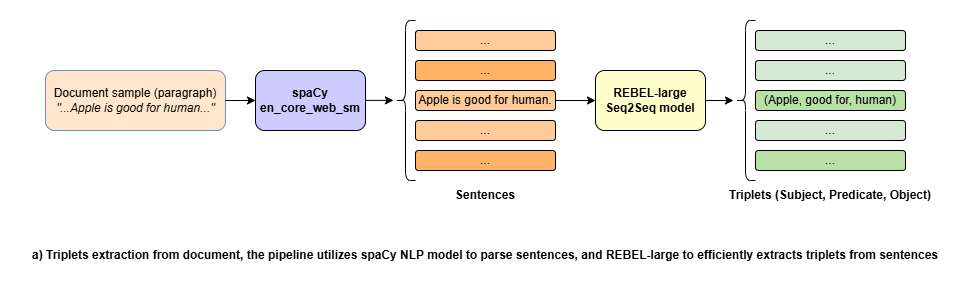
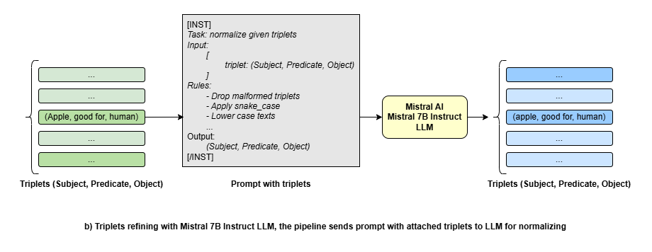
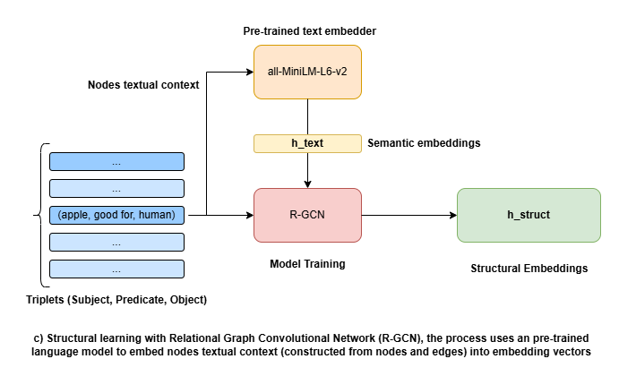

# GNN-based GraphRAG for Healthcare QA

## 1. Overview

This project implements a **Graph Neural Network (GNN)-enhanced Retrieval-Augmented Generation (GraphRAG)** system for healthcare question answering.

Instead of retrieving isolated text chunks, the system:

* Constructs a **Knowledge Graph (KG)** from a healthcare corpus
* Learns **structural-aware embeddings** using Relational-Graph Convolutional Network (R-GCN)
* Performs **hybrid retrieval** using both semantic and graph-based similarity
* Generates answers using a **quantized Qwen  LLM (GGUF)** on HuggingFace Spaces

HuggingFace Spaces Repository: [ndtdt/GNN-based-GraphRAG-for-Healthcare-QA](https://huggingface.co/spaces/ndtdt/GNN-based-GraphRAG-for-Healthcare-QA)

---

## 2. Dataset

We use a healthcare corpus derived from the [MedQA dataset (HuggingFace)](https://huggingface.co/datasets/cogbuji/medqa_corpus_en), covering 4 medical subspecialties: 

* Core Clinical Medicine
* Basic Biology 
* Pharmacology
* Psychiatry.

The dataset is also cached in the `dataset` folder for a completely local processing if necessary. 

---

## 3. System Architecture

The project consists of two main pipelines: **Offline pipeline** for heavy tasks such as knowledge extraction and model training, and **Online pipeline** to handle user query.

### Offline Pipeline

```
Dataset → Triplet Extraction → Refinement → KG → R-GCN → Embeddings
```

* Uses **spaCy** `en_core_web_sm` to parse sentences from texts
* Utilizes [REBEL-large](https://huggingface.co/Babelscape/rebel-large) Seq2Seq model to extract raw relations



* Utilizes [Mistral 7B Instruct v0.2](https://huggingface.co/TheBloke/Mistral-7B-Instruct-v0.2-GGUF/blob/main/mistral-7b-instruct-v0.2.Q4_K_M.gguf) LLM and an additional pre-processing step (`pre_processing.ipynb`) to refine triplets



* Feeds triplets into a R-GCN with initial node embeddings generated by [
all-MiniLM-L6-v2](https://huggingface.co/sentence-transformers/all-MiniLM-L6-v2) sentence-transformers model to incorporate structural information




### Online Pipeline (HuggingFace Spaces)

The online pipeline uses HuggingFace Spaces to host the **Qwen** model which receives and answer user query using the knowl

```
Query → Hybrid Retrieval → KG Traversal → Context → Qwen → Answer
```

---

## Environment installation

Please visit `requirements_cpu.txt` for a CPU-only pipeline, or `requirements_gpu.txt` for a CUDA-powered pipeline.

For the llama-cpp-python installation, please visit its [GitHub repository](https://github.com/abetlen/llama-cpp-python) to install the correct distribution.

---

## 4. Knowledge extraction and GNN training (offline)

Due to computational constraints on HuggingFace Free Tier, we performed the triplets parsing and model training locally. 

### Triplets parsing and Pre-processing

This stage utilizes a chain of models to extract and refine knowledge from the dataset.
 
```
MedQA → spaCy → REBEL → Mistral → Triplets → preprocessing → graph_edges.csv
```

### Input
* Text materials (in paragraphs)

### Output
* A `CSV` file contains relational triplets (Subject, Predicate, Object).

### Graph Representation

The triplets are converted into a graph using the `KnowledgeGraph` class:

* Nodes: entities (subjects & objects)
* Edges: relations (predicates)
* PyG format:

  * `edge_index`
  * `edge_type`

Additionally, an **adjacency structure** is built for efficient graph traversal during retrieval.

To perform the extraction, please navigate to the `ingestion` directory and execute the `ingest.py` file.

---

## 5. Node Embedding Initialization

The initial node embeddings are generated by a pre-trained
all-MiniLM-L6-v2 sentence-transformers model, which maps constructed nodes textual context into a 384 dimensional dense vector space:

### Input

* Triplets (Subject, Predicate, Object) from `graph_edges.csv`

### Output

* Initial node embeddings `x`
* Node-to-Id mappings `node2id`
* Constructed nodes textual context `node_texts`

Each node is represented by aggregated textual context derived from triplets.

---

## 6. GNN-based Structural Embedding (offline)

We adopt an R-GCN architecture implemented via PyTorch Geometric’s `RGCNConv`, which follows the relational message passing formulation. Unlike the [original paper](https://arxiv.org/abs/1703.06103), we train the model using a link prediction objective to produce structurally-aware embeddings for retrieval.

### Input

* Initial node embeddings `x` (MiniLM) 

### Computation

```
h = R-GCN(x, edge_index, edge_type)
```

### Output

* Structural embeddings `h`

These embeddings capture:

* multi-hop neighborhood information
* relational structure

To perform model training and fine-tuning, please navigate to the `gnn` directory and execute the `model_train.py` file.

---

## 7. HuggingFace Spaces Deployment (online)

The HuggingFace Spaces only includes:

* `graph_edges.csv` → Knowledge Graph (triplets)
* A `.pt` file contains node embeddings:

  * `x`: semantic embeddings (MiniLM output)
  * `h`: structural embeddings (R-GCN output)
  * `node2id`, `rel2id`: nodes and edges (relations) mappings for consistency

### Hybrid Retrieval

For a user query, we first utilizes MiniLM to encode it into an embedding vector `query`, then compute:

* **Semantic similarity**:

  ```
  sim_sem = cosine(query, x)
  ```

* **Structural similarity**:

  ```
  sim_struct = cosine(query, h)
  ```

#### Final Score

```
score = α * sim_sem + (1 - α) * sim_struct
```

Where:

* `α` controls semantic vs structural importance

Top-K nodes are selected based on this hybrid score.


### Graph-based Context Retrieval

Instead of retrieving raw text, we perform **graph traversal**:

1. Retrieve top-K nodes
2. Expand via **KnowledgeGraph adjacency**
3. Collect connected triplets

This ensures:

* multi-hop reasoning
* relational context
* structured knowledge grounding


### Answer Generation

We use:

* **Qwen3.5-4B (GGUF)**
* **llama.cpp backend**

#### Prompt Structure

```
Context (triplets from KG)
+ Question
→ Answer
```

The model generates concise answers grounded in the graph context.

#### Deployment Instruction

* Open the Space
* Enter a query
* Receive answer from GraphRAG system

---

## 8. Limitations
* Static Knowledge Graph (no real-time updates)
* Node representations depend on local triplet context
* Retrieval may miss long or complex entities

---

## 9. Future Development

* Enhance the knowledge base and the embeddings quality by upgrading the relation extraction and model training pipeline 
* Improve the RAG response 
