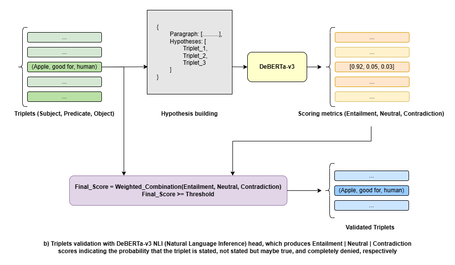

# GNN-based GraphRAG for Healthcare QA

## 1. Overview

This project implements a **Graph Neural Network (GNN)-enhanced Retrieval-Augmented Generation (GraphRAG)** system for healthcare question answering.

Instead of retrieving isolated text chunks, the system

* Constructs a **Knowledge Graph (KG)** from a healthcare corpus
* Learns **structural-aware embeddings** using Relational-Graph Convolutional Network (R-GCN)
* Performs **hybrid retrieval** using both semantic and graph-based similarity
* Generates answers using a **quantized Qwen3.5-4B LLM (GGUF)** on HuggingFace Spaces

GitHub Repository: [GNN-based GraphRAG for Healthcare QA](https://github.com/Sn-cpp/GNN-based-GraphRAG-for-Healthcare-QA).

Hugging Face Space: [GNN-based GraphRAG for Healthcare QA](https://huggingface.co/spaces/ndtdt/GNN-based-GraphRAG-for-Healthcare-QA/tree/main).

### Environment installation

Use `requirements_local.txt` to setup the environment.

For the `llama-cpp-python` installation, please visit its [GitHub repository](https://github.com/abetlen/llama-cpp-python) to install the correct distribution.

For `torch` and `torch_geometric`, please visit their sites [PyTorch](https://pytorch.org/get-started/locally/) and [PyTorch Geometric](https://pytorch-geometric.readthedocs.io/en/stable/install/installation.html) for detailed installation guide.

Ensure the `en_core_web_sm` model of spaCy is downloaded:

```cmd
python -m spacy download en_core_web_sm
```

---

## 2. Dataset

We use a healthcare corpus derived from the [MedQA dataset (HuggingFace)](https://huggingface.co/datasets/cogbuji/medqa_corpus_en), covering 4 medical subspecialties: 

* Core Clinical Medicine
* Basic Biology 
* Pharmacology
* Psychiatry

The dataset is cached in the `dataset` folder as backup.

---

## 3. System Architecture

The project consists of two main pipelines: **Offline pipeline** for heavy tasks such as knowledge extraction and model training, and **Online pipeline** to handle user query.

### Offline Pipeline

The procedure can be described as follows:

1. We use **spaCy** `en_core_web_sm` to parse sentences from texts, then construct the inputs for REBEL using per-sentence and sliding windows techniques to capture both local-sentence and cross-sentence relations. An example of the REBEL inputs is as follows:
```
REBEL_inputs = {
  [Sentence_1],
  [Sentence_1 /join Sentence_2],
  [Sentence_2],
  ...
}
```
2. To extract relation triplets (Subject, Predicate, Object), we utilize [REBEL-large](https://huggingface.co/Babelscape/rebel-large), which is a Seq2Seq model developed by **Babelscape**, built upon the BART (*Bidirectional and Auto-Regressive Transformers*) architecture and is specifically fine-tuned for end-to-end Relation Extraction (RE).


3. Since REBEL is an autoregressive model, it may suffer from hallucination and produce relations that are not stated or implied in the document. To handle this we utilize an additional validation stage to check if a relation is supported by the text, using [DeBERTa-v3-base](https://huggingface.co/MoritzLaurer/DeBERTa-v3-base-mnli-fever-anli) which strengthens BERT and RoBERTa (*Bidirectional Encoder Representations from Transformers*) using an enhanced mask decoder and a "disentangled attention" mechanism that improves on standard self-attention by representing each word using two separate vectors—content and relative position—rather than summing them. 



4. We then normalize and lemmatize (reducing word to base dictionary form) validated triplets using **spaCy** `en_core_web_sm` and dump into (.CSV) files inside `raw_triplets` directory. These triplets then get pre-processed (see [pre_processing.ipynb](./pre_processing.ipynb)) first before being used to build Knowledge Graph and train the GNN model.

5. For the graph structural learning, we utilize a **Relational-Graph Convolutional Network** (R-GCN) model to generate updated structurally aware node vectors, the initial semantic features are first generated by [all-MiniLM-L6-v2](https://huggingface.co/sentence-transformers/all-MiniLM-L6-v2) sentence-transformers model using the semantic context constructed from nodes and edges (relations).


### Online Pipeline (HuggingFace Spaces)

The online pipeline uses HuggingFace Spaces to host the **Qwen** model which receives and answer user query using the information from the knowledge graph.

```
Query -> Hybrid Retrieval -> KG Traversal -> Context -> Qwen -> Answer
```

---

## 4. Knowledge extraction and GNN training (offline)

Due to computational constraints on HuggingFace Free Tier, we performed the triplets parsing and model training locally. 

### Triplets parsing and Pre-processing

This stage utilizes a chain of models to extract and refine knowledge from the dataset.
 
```
MedQA -> spaCy -> REBEL -> DeBERTa-v3 -> Raw triplets -> Pre-processing -> Graph triplets
```

### Input
* Text materials (in paragraphs)

### Output
* A [`CSV` file ](./artifacts//graph_triplets/graph_edges.csv) contains ready-to-use triplets (Subject, Predicate, Object).

### Graph Representation

The triplets are converted into a graph using the `KnowledgeGraph` class:

* Nodes: entities (subjects & objects)
* Edges: relations (predicates)
* PyG format:

  * `edge_index`
  * `edge_type`

Additionally, an **adjacency structure** is built for efficient graph traversal during retrieval.

**Executing**: See [ingest.py](./ingest.py) for detailed running configuration. As for pre-processing, visit [pre_processing.ipynb](./pre_processing.ipynb).

---

## 5. Node Embedding Initialization

The initial node embeddings are generated by a pre-trained
all-MiniLM-L6-v2 sentence-transformers model, which maps constructed nodes textual context into a 384 dimensional dense vector space:

### Input

* Triplets (Subject, Predicate, Object) from `graph_edges.csv`

### Output

* Initial node embeddings `h_text`
* Node-to-Id mappings `node2id`
* Constructed nodes textual context `node_texts`

Each node is represented by aggregated textual context derived from triplets.

---

## 6. GNN-based Structural Embedding (offline)

We adopt an R-GCN architecture implemented via PyTorch Geometric’s `RGCNConv`, which follows the relational message passing formulation. Unlike the original paper [Modeling Relational Data with Graph Convolutional Networks](https://arxiv.org/abs/1703.06103), the model is trained with a **contrastive link prediction objective**, aligning structural embeddings with retrieval behavior.

### Input

* Initial node embeddings `h_text` (generated by MiniLM)
* Graph structure:
  * `edge_index`
  * `edge_type`

### Computation

**Forward pass (R-GCN):**
```python
h_struct = model(h_text, edge_index, edge_type)
```

**Query construction and projection (from textual to structural space):**
```python
q_text = normalize(h_text[src])
q_struct = model.project_query(q_text)
```

**Scoring (cosine similarity):**
```python
score = cosine_similarity(q_struct, h_struct[dst])
```

### Training Objective

The model is optimized using a combination of:
* **Contrastive loss (multi-negative sampling):** Encourages correct `(src, rel, dst)` triplets to score higher than corrupted ones:

```
# Multi-negative sampling
For each true triplet (src, rel, dst):
  positive_score = cosine_similarity(q_struct, h_struct[dst])
  
  neg_dst <- sample k(hyper-parameter) tail nodes randomly 
  negative_score = mean([ cosine_similarity(q_struct, h_text[node]) for node in neg_dst ])  

  triplet_loss = RELU(margin(hyper-parameter) - positive_score + negative_score)


# Constrastive loss
Contrastive_Loss = mean([ triplet_loss for all triplets ])  
```

* **Semantic alignment loss:** Keeps structural embeddings close to original text embeddings:
```
Alignment_Loss = mean(1 - cosine_similarity(h_struct, h_text))  
```
* **Variance regularization:** Prevents structural embedding from collapsing:
```
  std = std(h_struct, dim=0) # Standard deviation

  Variance_Loss = mean(RELU(1 - std))
```

**The combined loss is:**

Loss = Contrastive_Loss + $\lambda$ * Alignment_Loss + 0.01 * Variance_Loss

where $\lambda$ is a hyper-parameter controlling the contribution of the alignment term. 

### Output

* Structural embeddings `h_struct` (L2-normalized)
* Learned query projection `query_proj`

### Properties

These embeddings capture:
* Multi-hop neighborhood information
* Typed relational structure
* Alignment with semantic space for retrieval
* Compatibility with cosine-based ranking

### Implementation Notes

* The formulation `h = R-GCN(x, edge_index, edge_type)` in this system is extended with:
  * A query projection from semantic $\rightarrow$ structural space
  * A cosine-based retrieval objective
* L2 normalization is part of the model design, not a post-processing step.


**Executing**: See [train.py](./train.py) for detailed running configuration.

---

## 7. HuggingFace Spaces Deployment (online)

The HuggingFace Spaces includes:

* `graph_edges.csv` → Knowledge Graph (triplets)
* A `.pt` file contains embeddings and mappings:

  * `h_text`: semantic embeddings (MiniLM output)
  * `h_struct`: structural embeddings (R-GCN output)
  * `query_proj`: learned query projection from semantic $\rightarrow$ structural space
  * `node2id`, `rel2id`: nodes and edges (relations) mappings for consistency

### Hybrid ranking metric

For a user query, we first utilizes MiniLM to encode it into an embedding vector `q_emb`:
```
q_emb = MiniLM(query)
```

then compute:

* **Semantic similarity**:

  ```
  sim_sem = cosine(q_emb, x) for each x in h_text
  ```

* **Structural similarity**:

  ```
  q_struct = query_proj(q_emb)
  sim_struct = cosine(q_struct, h) for each h in h_struct
  ```

#### Final Score

We rank each node using the weighted combination of semantic and structural similarities:

```
score = α * sim_sem + (1 - α) * sim_struct
```

Where:

* `α` controls semantic vs structural importance

Top-K nodes are selected based on this hybrid scores.


### Graph-based Context Retrieval

Instead of retrieving raw text, we perform **score-aware graph traversal** driven by hybrid similarity:

* Retrieve the top-K nodes (using the hybrid ranking metric above)
* For each retrieved node:
  * Retrieve outgoing triplets via KnowledgeGraph adjacency
  * Score neighbors using object node scores from the same hybrid space
  * Apply adaptive filtering by computing threshold: `threshold = mean + λ · std` (where λ is a toleration factor), keep only neighbors with **score** $\geq$ **threshold**
* Collect connected triplets
* *Fallback*: ensure at least one triplet is retained

### Properties
This retrieval strategy ensures:
* Multi-hop reasoning via graph expansion
* Relevance-aware pruning of noisy neighbors
* Alignment with hybrid semantic–structural scoring
* Structured knowledge grounding for downstream LLM


### Answer Generation

We use:

* [**Qwen3.5-4B-Claude-4.6-Opus-Reasoning-Distilled-v2-GGUF**](https://huggingface.co/Jackrong/Qwen3.5-4B-Claude-4.6-Opus-Reasoning-Distilled-v2-GGUF)
* **llama.cpp backend**: [re-built](https://github.com/Sn-cpp/llama-cpp-python-cpu-wheels) from scratch using its public [source](https://github.com/abetlen/llama-cpp-python) and GitHub Action, in order to be able to deploy on Hugging Face Spaces with Gradio template.

#### Prompt Structure

```
Context (triplets from KG)
+ Question
+ Instruction
-> Answer
```

The model generates concise answers grounded in the graph context.

#### Deployment Instruction

* Open the Space
* Enter a query
* Receive answer from GraphRAG system

---

## 8. Limitations
* Static Knowledge Graph (no real-time updates)
* Node representations depend on local triplet context
* Retrieval may miss long or complex entities

---

## 9. Future Development

* Enhance the knowledge base and embedding quality by upgrading the relation extraction, adjusting triplets validation parameters, fine-tuning the GNN model for better structural incorporation,...
* Improve RAG response quality by experimenting different retrieval settings.

---

## 10. References

1. Schlichtkrull, M., Kipf, T. N., Bloem, P., Van Den Berg, R., Titov, I., & Welling, M.  
   *[Modeling Relational Data with Graph Convolutional Networks](https://arxiv.org/abs/1703.06103)* (R-GCN), 2017.

2. Bordes, A., Usunier, N., Garcia-Duran, A., Weston, J., & Yakhnenko, O.  
   *[Translating Embeddings for Modeling Multi-relational Data](https://arxiv.org/abs/1309.0346)* (TransE), 2013.

3. Bordes, A., Weston, J., Collobert, R., & Bengio, Y.  
   *[A Margin-Based Ranking Criterion for Learning Word Embeddings](https://www.jmlr.org/papers/volume14/bordes13a/bordes13a.pdf)*, 2013.

4. Chen, T., Kornblith, S., Norouzi, M., & Hinton, G.  
   *[A Simple Framework for Contrastive Learning of Visual Representations](https://arxiv.org/abs/2002.05709)* (SimCLR), 2020.

5. Oord, A. v. d., Li, Y., & Vinyals, O.  
   *[Representation Learning with Contrastive Predictive Coding](https://arxiv.org/abs/1807.03748)* (CPC), 2018.

6. Velickovic, P., Fedus, W., Hamilton, W. L., et al.  
   *[Deep Graph Infomax](https://arxiv.org/abs/1809.10341)*, 2019.

7. Bardes, A., Ponce, J., & LeCun, Y.  
   *[VICReg: Variance-Invariance-Covariance Regularization](https://arxiv.org/abs/2105.04906)*, 2022.

8. Karpukhin, V., Oguz, B., Min, S., et al.  
   *[Dense Passage Retrieval for Open-Domain Question Answering](https://arxiv.org/abs/2004.04906)* (DPR), 2020.